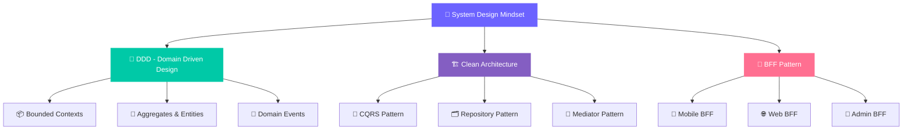
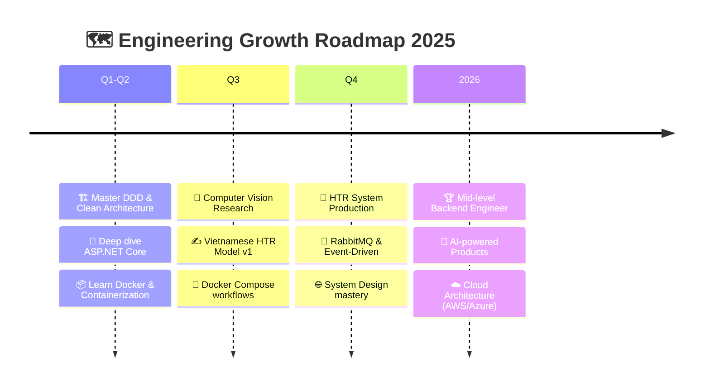

<div align="center">

<!-- ANIMATED HEADER BANNER -->


<!-- TYPING SVG -->
<a href="https://git.io/typing-svg">
  
</a>

<br/>

<!-- PROFILE BADGES -->
<a href="https://github.com/Kad1711">
  
</a>
<a href="https://github.com/Kad1711">
  
</a>
<a href="https://github.com/Kad1711">
  
</a>

<br/><br/>


<a href="https://github.com/Kad1711?tab=followers">
  
</a>


</div>

<br/>

<!-- ABOUT ME SECTION -->


<div align="center">

```
╔══════════════════════════════════════════════════════════════════════════════╗
║                                                                              ║
║   ███████╗ ██████╗ ███████╗████████╗██╗    ██╗ █████╗ ██████╗ ███████╗      ║
║   ██╔════╝██╔═══██╗██╔════╝╚══██╔══╝██║    ██║██╔══██╗██╔══██╗██╔════╝      ║
║   ███████╗██║   ██║█████╗     ██║   ██║ █╗ ██║███████║██████╔╝█████╗        ║
║   ╚════██║██║   ██║██╔══╝     ██║   ██║███╗██║██╔══██║██╔══██╗██╔══╝        ║
║   ███████║╚██████╔╝██║        ██║   ╚███╔███╔╝██║  ██║██║  ██║███████╗      ║
║   ╚══════╝ ╚═════╝ ╚═╝        ╚═╝    ╚══╝╚══╝ ╚═╝  ╚═╝╚═╝  ╚═╝╚══════╝      ║
║                                                                              ║
║   ███████╗███╗   ██╗ ██████╗ ██╗███╗   ██╗███████╗███████╗██████╗           ║
║   ██╔════╝████╗  ██║██╔════╝ ██║████╗  ██║██╔════╝██╔════╝██╔══██╗         ║
║   █████╗  ██╔██╗ ██║██║  ███╗██║██╔██╗ ██║█████╗  █████╗  ██████╔╝         ║
║   ██╔══╝  ██║╚██╗██║██║   ██║██║██║╚██╗██║██╔══╝  ██╔══╝  ██╔══██╗         ║
║   ███████╗██║ ╚████║╚██████╔╝██║██║ ╚████║███████╗███████╗██║  ██║         ║
║   ╚══════╝╚═╝  ╚═══╝ ╚═════╝ ╚═╝╚═╝  ╚═══╝╚══════╝╚══════╝╚═╝  ╚═╝         ║
║                                                                              ║
╚══════════════════════════════════════════════════════════════════════════════╝
```

</div>

---

##  **About Me — Who I Am**


```yaml
name: Nguyễn Khả Dương
location: Vietnam 🇻🇳
title: Software Engineer

positioning:
  primary: "Backend / System Design Engineer"
  secondary: "AI & Computer Vision Researcher"
  
architecture_mindset:
  - Domain-Driven Design (DDD)
  - Clean Architecture
  - Backend for Frontend (BFF)
  - System Design & Scalability
  - Headless Commerce
  - Microservices Pattern
  - Event-Driven Architecture

core_stack:
  backend:
    - ASP.NET Core
    - NestJS
    - Node.js / Express.js
  frontend:
    - React / Next.js
    - Nuxt.js
  databases:
    - SQL Server
    - PostgreSQL
    - MongoDB
    - Redis
  infrastructure:
    - Docker
    - RabbitMQ
    - CI/CD

research:
  - Computer Vision
  - Vietnamese Handwriting Recognition (HTR)
  - RAG & AI Integration
  - Local LLM Deployment

philosophy: >
  "Không chỉ viết code chạy được — mà viết code có kiến trúc,
   có hệ thống, có thể mở rộng và bảo trì trong dài hạn."
```

<br clear="right"/>

### 💡 Điều khác biệt của tôi

> **Tôi không chỉ liệt kê công nghệ — tôi hiểu cách chúng kết nối với nhau trong một hệ thống thực.**

- 🏗️ **System Thinking** — Thiết kế hệ thống theo DDD, Clean Architecture, không chỉ CRUD
- 🔀 **Backend-First Mindset** — ASP.NET Core, NestJS, Node.js với message queues (RabbitMQ), caching (Redis)
- 🧩 **BFF Pattern** — Tách biệt API layer cho từng client (Mobile, Web, Admin)
- 🛒 **Headless Commerce** — Xây dựng hệ thống e-commerce decoupled, linh hoạt
- 🤖 **AI Integration** — Tích hợp Computer Vision và LLM vào production system
- 📐 **Design Patterns** — Repository, CQRS, Mediator, Strategy áp dụng trong project thực tế

---

## 🏆 GitHub Trophies

<div align="center">
  
</div>

---

##  **Tech Arsenal**

<div align="center">

### 🏗️ Backend & System Design
> *The Core — Where Architecture Meets Execution*

<table>
<tr>
<td align="center" width="100">

<br><b>ASP.NET Core</b>
</td>
<td align="center" width="100">

<br><b>NestJS</b>
</td>
<td align="center" width="100">

<br><b>Node.js</b>
</td>
<td align="center" width="100">

<br><b>Express.js</b>
</td>
<td align="center" width="100">

<br><b>C#</b>
</td>
<td align="center" width="100">

<br><b>TypeScript</b>
</td>
</tr>
</table>

<br/>


---

### 🌐 Frontend & UI
> *Crafting Interfaces That Connect*

<table>
<tr>
<td align="center" width="100">

<br><b>React</b>
</td>
<td align="center" width="100">

<br><b>Next.js</b>
</td>
<td align="center" width="100">

<br><b>Nuxt.js</b>
</td>
<td align="center" width="100">

<br><b>JavaScript</b>
</td>
<td align="center" width="100">

<br><b>Tailwind</b>
</td>
<td align="center" width="100">

<br><b>SCSS</b>
</td>
<td align="center" width="100">

<br><b>Bootstrap</b>
</td>
<td align="center" width="100">

<br><b>Vite</b>
</td>
</tr>
</table>

---

### 🗄️ Database & Caching
> *Data Layer — Structured, Fast, Reliable*

<table>
<tr>
<td align="center" width="100">

<br><b>SQL Server</b>
</td>
<td align="center" width="100">

<br><b>PostgreSQL</b>
</td>
<td align="center" width="100">

<br><b>MongoDB</b>
</td>
<td align="center" width="100">

<br><b>Redis</b>
</td>
</tr>
</table>

---

### 📱 Mobile Development
> *Native Android — Kotlin-First Approach*

<table>
<tr>
<td align="center" width="100">

<br><b>Kotlin</b>
</td>
<td align="center" width="100">

<br><b>Java</b>
</td>
<td align="center" width="100">

<br><b>Android Studio</b>
</td>
</tr>
</table>


---

### 🤖 AI & Computer Vision
> *Intelligence Layer — Where Software Meets Cognition*

<table>
<tr>
<td align="center" width="100">

<br><b>Python</b>
</td>
<td align="center" width="100">

<br><b>PyTorch</b>
</td>
<td align="center" width="100">

<br><b>TensorFlow</b>
</td>
<td align="center" width="100">

<br><b>OpenCV</b>
</td>
</tr>
</table>


---

### ☁️ Infrastructure & DevOps
> *Ship It — From Local to Production*

<table>
<tr>
<td align="center" width="100">

<br><b>Docker</b>
</td>
<td align="center" width="100">

<br><b>Firebase</b>
</td>
<td align="center" width="100">

<br><b>RabbitMQ</b>
</td>
<td align="center" width="100">

<br><b>Nginx</b>
</td>
</tr>
</table>


---

### 🔧 Development Toolkit
> *The Essentials — Everyday Weapons*

<table>
<tr>
<td align="center" width="100">

<br><b>Git</b>
</td>
<td align="center" width="100">

<br><b>GitHub</b>
</td>
<td align="center" width="100">

<br><b>VS Code</b>
</td>
<td align="center" width="100">

<br><b>Visual Studio</b>
</td>
<td align="center" width="100">

<br><b>Postman</b>
</td>
<td align="center" width="100">

<br><b>Figma</b>
</td>
</tr>
</table>

</div>

---

## 🏛️ Architecture & Design Philosophy

<div align="center">



</div>

<details>
<summary><b>🔍 Tại sao kiến trúc quan trọng hơn công nghệ? (Click để mở)</b></summary>
<br/>

> *"Một developer giỏi không chỉ biết dùng framework — mà biết TẠI SAO chọn framework đó và làm sao để hệ thống có thể scale."*

| Principle | Mô tả | Áp dụng |
|-----------|--------|---------|
| **DDD** | Mô hình hóa domain business phức tạp | E-commerce, CRM systems |
| **Clean Architecture** | Tách biệt concerns, testable, maintainable | Mọi project production |
| **CQRS** | Tách read/write model cho performance | High-traffic systems |
| **BFF** | API layer riêng cho từng client | Multi-platform apps |
| **Event-Driven** | Loose coupling qua message queue | Microservices, real-time |
| **Headless Commerce** | Decoupled frontend/backend commerce | Scalable e-commerce |

</details>

---

## 🚀 Featured Projects

<div align="center">

### ⚡ Project Showcase

</div>

<table>
<tr>
<td width="50%">

### 📱 PhoneStore AI
> **E-commerce + AI Chatbot**


🛒 Hệ thống thương mại điện tử tích hợp AI chatbot tư vấn sản phẩm thông minh, truy vấn dữ liệu real-time từ MongoDB.

**Stack:** `Node.js` `Express` `MongoDB` `LM Studio`

**Architecture Highlights:**
- 🧠 Local LLM Integration qua LM Studio
- 🔍 NLP: Nhận diện tên máy, màu, dung lượng
- 📦 Real-time inventory query
- 💬 Conversation History Management
- 🛡️ JWT Authentication

<p>
<a href="https://github.com/Kad1711/PhoneStore-AI">
  
</a>
</p>

> 🔮 **Roadmap:** `RAG` • `Semantic Search` • `Vector DB`

</td>
<td width="50%">

### 🎧 Spotify Fullstack Clone
> **Android + REST API + Admin**


🎵 Full-stack music streaming platform: Android client + Backend API + Admin Dashboard.

**Stack:** `Kotlin` `Java` `Node.js` `Express` `MongoDB` `JWT`

**Architecture Highlights:**
- 📱 Native Android Client (Kotlin)
- 🔐 JWT-based Authentication
- 🎵 Music Streaming Engine
- ❤️ Favorites & Playlists
- 🛠️ Admin Dashboard
- 🌐 RESTful API Design

<p>
<a href="https://github.com/spotify-clone-team/Spotify_Fullstack_Clone">
  
</a>
</p>

> 🔮 **Roadmap:** `Offline Mode` • `Push Notifications`

</td>
</tr>
<tr>
<td width="50%">

### 🏛️ Vietnamese Cultural Heritage
> **Full-stack Web Platform**


🏛️ Nền tảng giới thiệu, quản lý và khám phá di sản văn hóa Việt Nam với Map Integration.

**Stack:** `React` `Node.js` `MongoDB` `Cloudinary`

**Architecture Highlights:**
- 🖼️ Cloudinary Image Pipeline
- 🗺️ Interactive Map Integration
- ⚙️ RESTful Backend API
- 📱 Responsive Design
- ☁️ Cloud Deployment

<p>
<a href="https://github.com/Kad1711/Website_DiSanVanHoa">
  
</a>
</p>

</td>
<td width="50%">

### 📱 UED Focus Keeper
> **Android Pomodoro App**


⏱️ Ứng dụng quản lý thời gian học tập theo phương pháp Pomodoro, xây dựng với Jetpack Compose.

**Stack:** `Kotlin` `Jetpack Compose` `Android Studio`

**Architecture Highlights:**
- ⏱️ Pomodoro Timer Engine
- 📚 Study Session Tracking
- 🎯 Focus Analytics
- 🎨 Material Design 3 UI
- 📱 Modern Compose Architecture

<p>
<a href="https://github.com/Kad1711/UEDFocusKeeper">
  
</a>
</p>

</td>
</tr>
</table>

---

## 🔬 Currently Building

<div align="center">

### ✍️ Vietnamese Handwriting Recognition System
> **`Research & Development` — Computer Vision × AI × Web**

</div>

<table>
<tr>
<td width="60%">

Hệ thống nhận diện và số hóa chữ viết tay tiếng Việt từ bài tự luận, biểu mẫu và tài liệu viết tay — kết hợp **Computer Vision**, **HTR Model** và **Web Platform**.

**🧰 Technology Direction:**

`Python` `OpenCV` `PyTorch` `Computer Vision` `HTR` `React` `Node.js` `MongoDB`

**🎯 System Goals:**
- 📄 Upload ảnh / tài liệu viết tay
- 🖼️ Image Preprocessing Pipeline
- 🔍 Document Layout Analysis
- ✍️ Vietnamese HTR Engine
- 📝 Handwriting → Digital Text
- ✏️ Human-in-the-Loop Verification
- 🌐 Web-based Document Management
- 🤖 AI-assisted Processing Pipeline

</td>
<td width="40%">

**🚧 Development Progress:**

```
Research & Papers  ████████░░  80%
Web Platform       ██████░░░░  60%
CV Pipeline        █████░░░░░  50%
HTR Model          ███░░░░░░░  30%
RAG Integration    ██░░░░░░░░  20%
Production Ready   █░░░░░░░░░  10%
```

<br/>


**Architecture:**
```
┌─────────────┐
│  React Web  │
└──────┬──────┘
       │ BFF
┌──────┴──────┐
│  Node.js    │
│  Backend    │
└──────┬──────┘
       │
┌──────┴──────┐
│  Python AI  │
│  Pipeline   │
│  CV → HTR   │
└──────┬──────┘
       │
┌──────┴──────┐
│  MongoDB    │
└─────────────┘
```

</td>
</tr>
</table>

---

## 📊 GitHub Analytics

<div align="center">


<br/>


<br/><br/>


</div>

---

## 🐍 Contribution Snake

<div align="center">
  <picture>
    <source media="(prefers-color-scheme: dark)" srcset="https://raw.githubusercontent.com/Kad1711/Kad1711/gh-pages/github-contribution-grid-snake-dark.svg" />
    <source media="(prefers-color-scheme: light)" srcset="https://raw.githubusercontent.com/Kad1711/Kad1711/gh-pages/github-contribution-grid-snake.svg" />
    
  </picture>
</div>

---

## 🎯 2025 Roadmap

<div align="center">



</div>

---

## 🧠 Engineering Mindset

<div align="center">

| 🎯 Principle | 💡 Practice |
|:---:|:---|
| **Architecture First** | Thiết kế hệ thống trước khi code — DDD, Clean Architecture, CQRS |
| **Backend Depth** | Không surface-level — hiểu sâu database, caching, message queue |
| **Production Mindset** | Code phải deployable, scalable, maintainable |
| **AI × Engineering** | AI không chỉ là model — mà là pipeline: preprocessing → inference → post-processing |
| **Continuous Learning** | Mỗi ngày đọc, build, refactor, review |

</div>

<div align="center">

```
"Junior biết dùng framework.
 Mid-level biết chọn framework.
 Senior biết khi nào KHÔNG cần framework."

 — Đang trên hành trình từ Junior → Mid-level
```

</div>

---

## 📫 Let's Connect

<div align="center">

<a href="mailto:nguyenkhaduong17@gmail.com">
  
</a>

<a href="https://github.com/Kad1711">
  
</a>

<br/><br/>


</div>

---

<div align="center">


<br/>

**`🏗️ Design → 💻 Build → 🧪 Test → 🚀 Ship → 🔄 Iterate`**

<br/>


</div>
